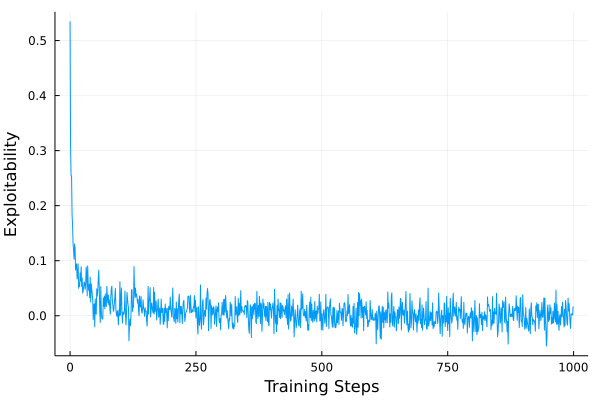

# BestResponsePOMDP.jl

Converts extensive form games into POMDPs by keeping one players' strategy constant.

Currently, only the generative model is known, so POMCP is the only online solver able to efficiently compute an approximates best response.

## Usage
```julia
using CounterfactualRegret
using CounterfactualRegret.Games
using BestResponsePOMDP

game = Kuhn()
sol = CFRSolver(game)
e_sol = POMCPExploitabilitySolver(sol, POMCPSolver(max_depth=10, max_time=0.1, tree_queries=10_000))
cb = POMCPExploitabilityCallback(e_sol, 1)
train!(sol, 1000, cb=cb; show_progress=true)

using Plots
plot(cb.hist)
```


